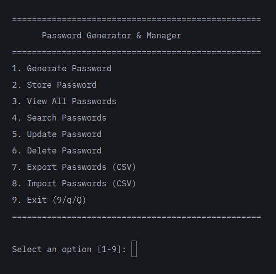

<div align="center">
    <h1>EigenVault: Password CLI Tool</h1>
    <h4>Password Generator and Manager</h4>
</div> <br>

<div align="center">
    
    
    
</div>

###### Video Demo: [youtube-link]()

## Table of Contents

- [Features](#features)
- [Description](#description)
- [Requirements](#installation)
- [Usage](#usage)
- [Tests](#tests)

## Features
<div align="center">

</div>

- **Generate** — create secure passwords with configurable length and character sets (uppercase, lowercase, digits, special characters)
- **Store** — save passwords locally in a CSV file, with multiple accounts supported per website. Each entry can include an optional note (e.g. "work account", "personal")
- **View** — browse all stored passwords at a glance with masked display
- **Search** — quickly find entries by website name, URL, or username
- **Update** — change a stored password to a new value (generated or manual)
- **Delete** — remove individual entries with confirmation
- **Export** — write all entries to a browser-compatible CSV file (importable into Chrome, Firefox, etc.)
- **Import** — merge passwords from a browser export CSV into your local store
- **Clipboard copy** — generated passwords are automatically copied to the clipboard

## Description

EigenVault is a command-line password generator and manager built entirely in Python. It provides a secure, offline alternative to cloud-based password managers by storing credentials in a browser-compatible CSV file format. The project was designed with simplicity and usability in mind—no databases, no servers, no accounts to create. Everything runs locally on your machine, and you retain full ownership of your data at all times.

The core of EigenVault is the `project.py` module, which implements a complete password management workflow through an interactive terminal menu. Users can generate secure passwords using Python's `secrets` module, which draws from the operating system's CSPRNG rather than the deterministic `random` module. The generator supports configurable character sets—uppercase, lowercase, digits, and special characters—and enforces a minimum password length of 8 characters. Every generated password is evaluated against a regular expression pattern that validates the presence of all four character types and the minimum length requirement, giving immediate feedback on password strength.

Storing passwords is handled through a CSV-based persistence layer that mirrors the export and import format used by major browsers like Chrome and Firefox. The columns are `name`, `url`, `username`, `password`, and `note`. When a user saves a password, the application automatically extracts the domain name from the provided URL and populates the `name` field, so entries are always self-documenting. Multiple accounts on the same website are supported—each store action creates a new entry rather than overwriting an existing one. A URL format check ensures only valid URLs (with `http://` or `https://` protocol) are accepted.

Searching, updating, and deleting entries all follow the same interaction pattern: the user enters a search query that is matched against the name, URL, and username fields across all stored entries. Results are displayed in a numbered list, and the user selects which entry to act on. This approach eliminates ambiguity when multiple accounts share a similar domain name. The copy-to-clipboard feature uses `pyperclip` as its primary backend, with `tkinter` as a fallback, ensuring cross-platform compatibility across Linux, macOS, and Windows.

The import and export features enable seamless migration between EigenVault and browser password managers. Exporting writes all stored entries to a CSV file that can be directly imported into Chrome or Firefox. Importing reads a browser-exported CSV, merges new entries into the existing store, and updates any entries that match on URL and username. The export flow also includes an overwrite confirmation prompt if the target file already exists.

The project includes a comprehensive test suite written with pytest using temporary file fixtures. Tests cover every public function—password generation with edge cases for length and character set combinations, strength validation against the regex, CSV read/write operations, search matching across fields, indexed deletion and update, and round-trip export/import fidelity.

EigenVault requires only one external dependency: `pyperclip` for clipboard access. Everything else relies on the Python standard library.

## Requirements

```bash
pip install pyperclip
```

## Usage

```bash
python3 project.py
```

The interactive menu will guide you through all available features.

## Tests

Run the test suite with:

```bash
pytest test_project.py -v
```

---
Made by Nihal Sheikh 2026
