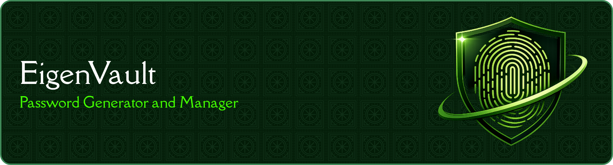

# 🛡️ EigenVault

<p align="center">
  
</p>

<p align="center">
  <strong>Securing your digital life, bit by bit.</strong>
</p>

<p align="center">
  
  
  
  
</p>

---

**EigenVault** is an enterprise-grade password management solution designed for the modern terminal and browser. It combines military-grade encryption with a beautiful, intuitive user interface to keep your credentials safe and accessible across all your devices.

## ✨ Features

- **Terminal First**: A powerful CLI with a beautiful UI powered by `rich`.
- **Browser Compatible**: Seamlessly syncs with Chrome, Firefox, and Safari extensions.
- **Unbreakable Security**: Uses AES-256-GCM encryption and PBKDF2 key derivation.
- **Biometric Ready**: Support for fingerprint/FaceID unlock in the browser extension.
- **Smart Generation**: Highly customizable, cryptographically secure password generator.

## 🚀 Installation

To install EigenVault as a system-wide command:

```bash
# Clone the repository
git clone https://github.com/yourusername/eigen-vault.git
cd eigen-vault

# Install using pip (standard)
pip install .

# Or install for development (editable mode)
pip install -e .
```

After installation, you can access the vault using `eigen`, `eigen-vault`, or `ev`.

## 🛠️ Usage

### CLI Commands

| Command | Description | Shortcut |
|---------|-------------|----------|
| `ev -g` | Generate a secure password | `--generate` |
| `ev -l 24` | Set length for generated password | `--length` |
| `ev -a` | Add a new entry to the vault | `--add` |
| `ev -s <query>` | Search your vault | `--search` |
| `ev -ls` | List all stored credentials | `--list` |

### Terminal UI

Simply run `ev` without any flags to enter the interactive dashboard:

```bash
ev
```

## 🌐 Browser Extension

EigenVault is supported on:
- **Chromium** (Chrome, Arc, Brave, Vivaldi)
- **Firefox**
- **Safari**

To install, navigate to the `extension/` directory and follow the instructions in the [Extension README](extension/README.md).

## 📂 Project Structure

```text
├── eigen_vault.py      # Main CLI Logic
├── setup.py            # Package Installer
├── extension/          # Browser Extension Source
├── public/             # Assets & Images
│   └── tutorial/       # Place tutorial screenshots here
└── README.md           # You are here
```

## 🔒 Security Architecture

EigenVault follows industry best practices:
1. **Key Derivation**: PBKDF2-HMAC-SHA256 with 600,000 iterations.
2. **Encryption**: AES-256-GCM (Authenticated Encryption with Associated Data).
3. **Local Only**: Your master password and vault never leave your machine/browser.

---

<p align="center">
  Built with ❤️ by Nihal Sheikh
</p>
